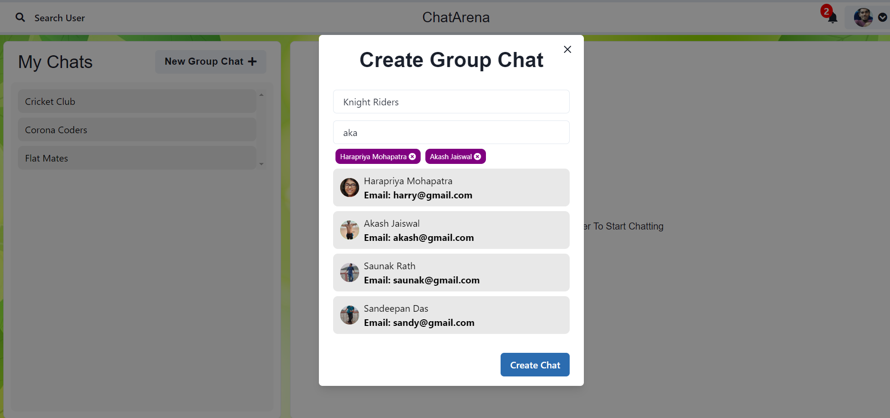

# ChatArena

ChatArena is a Full Stack MERN chat application that uses Socket.io for realtime interaction
and stores the user details and their passwords in encrypted format in the Mongo DB database.


## Tech Stack

**Client:** React, Redux, React Bootstrap

**Server:** Node JS, Express JS

**Database:** Mongo DB


## Demo

**The deployed chat application link:**

https://chatarena-app.herokuapp.com/


## Run Locally

**Clone the project**

```bash
  git clone https://github.com/Hara0706/ChatArena
```

**Go to the project directory**

```bash
  cd Chatarena
```

**Install dependencies**

```bash
  npm install
```
```bash
  cd frontend/
  npm install
```

**Start the server**

```bash
  npm run start
```


## Features

**Authentication**

- The Sign Up feature is used for registering a new user by entering 
  his/her details.


- The Login feature is used by an already registered user to sign in
  into the application.
- The Login Box also provides with the Guest User Credentials feature
  so that anyone can use the app without registering also.


**Realtime Chatting**

- Users can have a great chatting experience with the typing
  indicators provided.
- Notifications feature is available to notify a user if he/she has
  received any messages.
- Users can have one-to-one chat and even group chats.
- The app also provides with the logout functionality.

- Users can be searched for one-to-one chat.


- Profiles of users can also be viewed.


**Group Chats**

- A user can create a group chat as an admin and add/remove users
  in the group by searching them easily.



- A group chat name can also be updated.
- A user can leave the group also.


## Author

- [@Hara0706](https://www.github.com/Hara0706)

